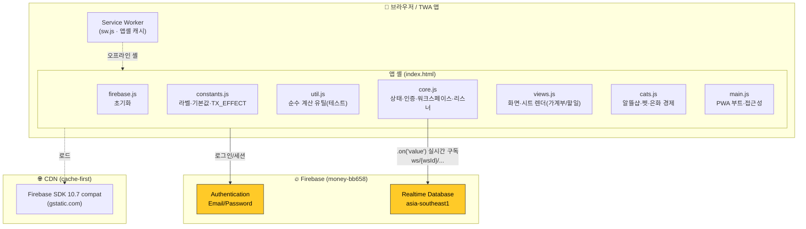
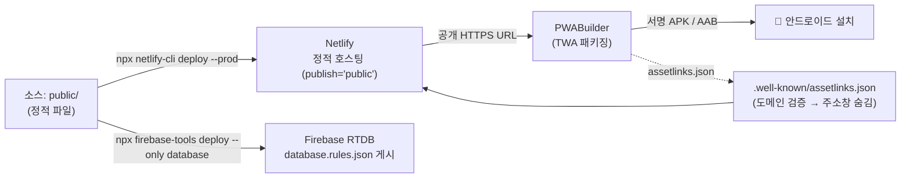
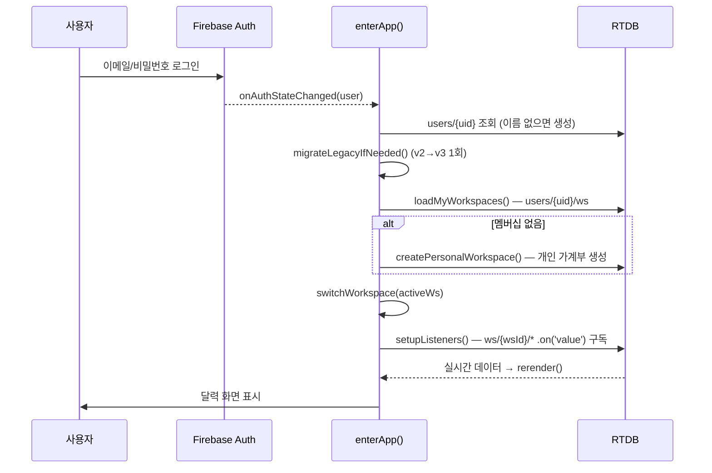
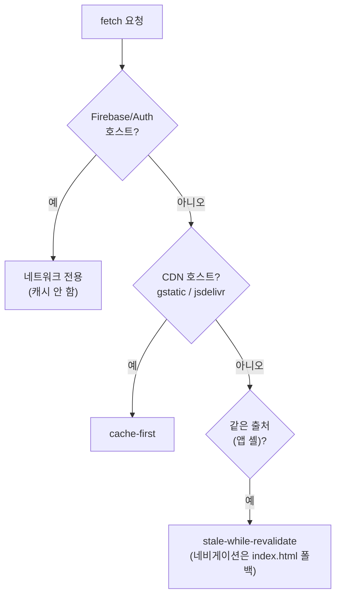

# 🏗️ 시스템 구성도

공유 가계부는 **빌드 단계가 없는 순수 정적 PWA** 입니다. 프런트엔드(Vanilla JS)가 Firebase(Auth + Realtime Database)에 직접 연결되며, 별도 백엔드 서버가 없습니다(서버리스).

## 컴포넌트 다이어그램

- **모듈 로드 순서**(`index.html` script 태그): `firebase.js → constants.js → util.js → core.js → views.js → cats.js → main.js`. 모든 함수는 전역(window) 스코프를 공유하며, HTML `onclick` 속성에서 직접 호출합니다. 자세한 내용은 [code-structure.md](code-structure.md).
- **두 모드**: 상단 모드 토글(`setMode`)로 **가계부**([features-ledger.md](features-ledger.md))와 **할일**([features-todo.md](features-todo.md)) 화면을 오갑니다 — 하단 탭바(`renderTabBar`)와 본문(`rerender`)이 모드별로 전환되고, 데이터는 같은 `ws/{wsId}` 아래에 공존합니다.
- **compat SDK 필수**: `firebase-*-compat.js` 빌드를 사용합니다(모듈형 아님).

## 배포 다이어그램

| 대상 | 도구 | 비고 |
|---|---|---|
| 웹 호스팅 | Netlify CLI | `netlify.toml` 의 `publish="public"`. 자세히는 [netlify.md](deploy/netlify.md) |
| DB 규칙 | firebase-tools CLI | `database.rules.json` → `money-bb658`. [FIREBASE.md](deploy/firebase.md) |
| 이메일 로그인 활성화 / 승인 도메인 | **Firebase 콘솔(수동)** | CLI 불가 — 콘솔에서만 |
| 안드로이드 APK | PWABuilder(TWA) | 배포된 HTTPS 필요. [APK.md](deploy/apk.md) |

## 로그인 → 부트 시퀀스

`auth.onAuthStateChanged` → `enterApp` 흐름. (`core.js`)

- 데이터가 비어 있으면 기본 계좌(`buildDefaultAccounts`)·기본 카테고리(`buildDefaultCategories`)를 자동 시딩.
- 워크스페이스 전환 시 `detachListeners()` → 상태 초기화(`resetWorkspaceState`) → 새 `ws/{wsId}` 리스너 재구독.
- 모든 데이터는 Firebase `.on('value')` 실시간 구독이라, 그룹 멤버의 변경이 즉시 반영됩니다.

## 서비스워커 캐시 전략

`public/sw.js` (버전 문자열 예: `eggarden-v3.121.0`). 출처별로 전략이 다릅니다.

| 자원 | 전략 | 이유 |
|---|---|---|
| Firebase RTDB / Auth (`firebaseio.com`, `firebasedatabase.app`, `googleapis.com`, `identitytoolkit`, `firebaseapp.com`) | **네트워크 전용** | 실시간 데이터·인증은 항상 최신 |
| CDN 라이브러리 (Firebase SDK) | **cache-first** | 버전 고정, 거의 안 바뀜 |
| 앱 셸 (HTML/CSS/JS/아이콘) | **stale-while-revalidate** | 빠른 로딩 + 백그라운드 갱신, 오프라인 동작 |

> 앱 셸에 새 파일을 추가하면 `sw.js` 의 `APP_SHELL` 목록과 `CACHE_VERSION` 을 함께 올려야 즉시 갱신됩니다.
