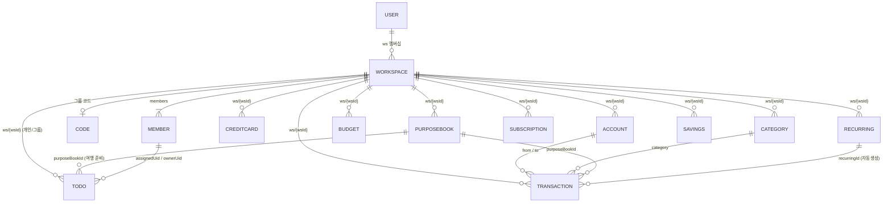

# 🗄️ 데이터 모델

저장소는 **Firebase Realtime Database**(프로젝트 `money-bb658`, asia-southeast1). 모든 가계부 데이터는 워크스페이스(`ws/{wsId}`) 아래에 격리됩니다. 보안규칙 원본은 `database.rules.json`, 상세 설명은 [RULES.md](deploy/rules.md).

## RTDB 트리 구조

```
users/{uid}            : { name, email, photo(프로필 사진 base64 data URL), createdAt, activeWs, welcomeGift(true=회원가입 축하선물 지급 완료·1회 멱등), ws:{ {wsId}:true },
                           todos:{ {id}:{ title, note, dueDate, done, doneAt, repeat, purposeBookId?, rewardClaimed, sortOrder, createdAt, updatedAt } },  // ✅ 개인 할일(user-global — 워크스페이스 무관·항상 동일). 소유자=uid 암묵
                           todosMigrated: true,                    // 개인 할일 ws→user 1회 이전 완료 플래그
                           todoPublic: true|false,                 // 내 개인 할일을 친구에게 공개할지(친구 스트립·열람 대상)
                           friendCode: "ABC123",                   // 내 친구 코드(friendCodes 인덱스와 짝)
                           friends:{ {friendUid}:{ name, at } },   // 상호 친구(수락 시 양쪽 기록)
                           friendReqs:{ {fromUid}:{ name, at } },  // 받은 친구 요청(수락 시 삭제)
                           game:{ 🐱 고양이집(개인 전역, 워크스페이스 무관)
                             coins,                                  // 은화 잔액(정수)
                             gold,                                   // 금화(뽑기 오픈마다 +1)
                             owned:{ cats:{ {catId}:{boughtAt} }, items:{ {itemId}:{boughtAt,qty} }, wallpapers:{ {wallId}:{boughtAt} } },
                             consum:{ food, water, egg, box, rainbow_egg, rainbow_box },  // 🎒 가방(보유 소비 아이템 수): 사료·물(그릇 채움) + 펫알·랜덤박스(일반 확률 오픈) + 무지개알·무지개박스(특별↑ 오픈)
                             home:{ active:[catId…], placed:{ {"r_c"}:{itemId, filledAt?} }, wallpaper:wallId, poops, slots },  // filledAt=밥/물 채운 시각(ms, 3h 뒤 비워지며 poops+1) · poops=미수거 똥 수(탭 시 +2은화) · slots=활성 슬롯 수(기본3·금화로 확장)
                             missions:{ {periodKey}:{ {missionId}:{claimed,reward,at} } },  // periodKey=KST 일자 2026-07-01(day)·주(week)·once. 일일/주간/업적 수령 기록(멱등)
                             customMissions:{ {id}:{ title, coinReward, active, createdAt, order } },  // 🎯 내 미션(커스텀 습관) 정의
                             missionLogs:{ {missionId}:{ "YYYY-MM-DD":{ done, paid, at } } },  // 내 미션 체크인 로그(날짜키=하루1회 멱등, paid=최초 지급 표시 → 재체크 재지급 방지)
                             gifts:[ { type:'coins'|'consum', key?, qty, code, at } … ],  // 🎁 선물함(코드 보상 대기 목록) — 받기(claimGift) 시 은화는 coins로, 아이템은 consum(가방)으로
                             codes:{ {code}:{at, n} }                 // 사용한 프로모/치트 코드(일반 1회·개발자 무한). n=사용 횟수
                           } }
workspaces/{wsId}      : { name, photo(가계부 사진 base64 data URL, 선택), type:'personal'|'group', code(그룹), ownerUid, createdAt,
                           members:{ {uid}:{ name, role:'owner'|'member', joinedAt } } }
codes/{CODE}           : wsId            // 그룹 6자리 코드 → 워크스페이스 조회 인덱스
friendCodes/{CODE}      : uid            // 친구 6자리 코드 → 사용자 uid 조회 인덱스
migrationV3            : { by, at }      // v2→v3 데이터 1회 이전 잠금 플래그
catalogPets/{id}       : { name, species, speciesLabel?, tier, scale, frontWalk, hasArt?, deleted?, by, at }  // 🐯 런타임 펫/정적 오버라이드 **메타데이터**(앱에서 dev가 zip 업로드·수정·삭제 → 전역). 읽기=전체, 쓰기=개발자 이메일만(규칙). 앱 로드 시 PET_CATALOG/PET_SPRITES/CAT_TIER/SPECIES_LABEL에 병합. 신규 런타임 펫 또는 정적 펫 오버라이드(이름·등급·디자인·`deleted:true` 소프트삭제) 겸용. `hasArt:true`=이미지가 catalogPetArt에 있음(지연 로드). ※구 레코드는 `walk/south/…` 인라인 data URL을 가질 수 있음(하위호환) — `migrateCatalogArtOnce()`로 분리 이전
catalogPetArt/{id}     : { walk, south, north, east, west(=data URL PNG) }  // 🖼️ 런타임 펫 스프라이트(base64) — 메타와 분리 저장. 앱 시작 땐 안 받고, 실제로 보이는 펫만 `ensurePetArt()`가 `.once`로 1회 받아 세션 캐시(초기 로딩/재푸시 부담↓). 읽기=전체, 쓰기=개발자 이메일만
ws/{wsId}/             : 가계부 데이터 (아래 노드들)
  ├─ accounts/{id}
  ├─ creditCards/{id}
  ├─ categories/{name}
  ├─ budgets/{id}
  ├─ subscriptions/{id}
  ├─ purposeBooks/{id}
  ├─ people/{id}
  ├─ giftEvents/{id}
  ├─ plannedGiftEvents/{id}
  ├─ loans/{id}                  // 대출/이자
  ├─ loanPayments/{id}           // 대출 상환 기록
  ├─ todos/{id}                  // 할일(개인/그룹 — scope 필드로 구분)
  ├─ todoShare/{uid}             // 개인 할일 공유 on/off(멤버별)
  ├─ settings                    // 워크스페이스 공동 설정(기본 공개범위/소유자)
  ├─ catDeleted/{name}           // 삭제한 기본 카테고리 툼스톤(재시딩 방지)
  ├─ transactions/{uid}/{id}     // 사용자별로 분리 저장
  ├─ savings/{uid}/{id}
  ├─ recurring/{uid}/{id}
  ├─ recurringLogs/{uid}/{key}   // 반복거래 멱등 로그
  └─ settlementPayments/{uid}/{id}   // 정산 송금 완료/취소 기록(Step 9)
```

> `transactions`/`savings`/`recurring`/`recurringLogs` 는 `{uid}` 하위로 한 단계 더 나뉘어 누가 기록했는지 보존합니다. 앱은 리스너에서 `ownerUid` 를 붙여 평탄화합니다(`setupListeners` in `core.js`).

## ERD (엔티티 관계)



## 핵심 엔티티 필드

### transactions/{uid}/{id}
`type`, `date`(ISO), `amount`, `desc`, `category`, `from`(차감 계좌), `to`(가산 계좌), `user`(**소비 대상** — 지출/선불결제/포인트사용 시 입력 시트에서 선택한 멤버명 또는 `공동`. 출금 수단(`from`)과 분리. 그 외 유형·기본값은 본인명), `memo`, `isActualExpense`(통계 포함 여부), `recurringId`, `cardPerformanceIncluded`·`cardPerformanceAmount`·`cardPerformanceExcludedReason`, `purposeBookId`·`purposeBookName`. **정산(Step 9, 활성)**: `settlementIncluded`(bool), `payer`, `splitType`(none/equal/custom/payer_only), `splitParticipants`[], `splitAmounts`{이름:금액}, `settlementStatus`(none/unsettled/partially_settled/settled), `settlementMemo`. **경조사비**: `giftEventId`. **대출**: `loanId`(연결된 대출의 이자 거래). **해외통화(여행)**: `currency`(예: USD)·`foreignAmount`(외화 원금)·`fxRate`(원화 per 1단위)·`fxSource`(live/manual)·`fxDate` — 없으면 원화. `amount`는 항상 **원화 환산액**이라 통계·잔액·예산은 그대로. **`userUid`**(소비 대상이 멤버일 때 그 멤버 uid를 병행 저장 — 리포트 개인별 집계를 uid로 해 **동명이인·개명에 견고**. `user`는 표시용 이름으로 계속 저장, 공동/레거시 거래는 uid 없음). (리스너가 `ownerUid`·`id` 부착)

### 경조사비 (people / giftEvents / plannedGiftEvents)  — 모두 flat `ws/{wsId}/...`
- **people/{id}**: `name`, `relation`(REL_TYPES), `memo`, `createdAt`·`updatedAt`. 경조사비 기록 시 상대 이름으로 자동 등록.
- **giftEvents/{id}**: `personId`·`personName`, `relation`, `eventType`(GIFT_EVENT_TYPES), `direction`(given/received), `amount`, `date`, `memo`, `linkedTransactionId`·`linkedAccount`(거래 연결 시), `owner`, `visibility`, `createdAt`·`updatedAt`.
- **plannedGiftEvents/{id}**: `personName`, `eventType`, `expectedAmount`, `date`, `status`(planned/completed/cancelled), `memo`, `createdAt`·`updatedAt`.

### settings  — `ws/{wsId}/settings` (워크스페이스 공동 설정)
`defaultVisibility`(full/private — 새 항목 기본 공개범위), `defaultOwner`(common/me — 새 항목 기본 소유자), `updatedAt`. 멤버 누구나 쓰기(ws 멤버 규칙). 앱은 `defaultVisibility()`·`defaultOwnerName()`로 생성 폼 기본값에 반영.

### 멤버/권한 (workspaces/{wsId}/members)
`members/{uid}:{name, role(owner/member), joinedAt}` + `ownerUid`. 소유자 전용 동작(이름 변경·소유자 이전·멤버 내보내기)은 **앱 UI에서만 제한**(RTDB 규칙은 그룹 멤버 공동 쓰기 유지). 소유자 이전 = `ownerUid` + 두 멤버 `role` 갱신.

### 대출 (loans / loanPayments)  — 모두 flat `ws/{wsId}/...`
- **loans/{id}**: `name`, `direction`(borrowed/lent), `counterparty`, `principal`(원금), `interestRate`(연%), `startDate`·`dueDate`, `account`(기본 상환계좌), `status`(active/paid/overdue), `memo`, `owner`, `visibility`, `createdAt`·`updatedAt`. 잔액·이자는 `loanCalc`로 계산(저장 안 함).
- **loanPayments/{id}**: `loanId`, `date`, `principalAmount`(원금 상환), `interestAmount`(이자), `account`, `memo`, `linkedTransactionId`(이자 거래), `linkedPrincipalTxId`(원금 거래 — 실지출 통계 제외 `isActualExpense:false`), `createdAt`·`updatedAt`. 상환 시 원금·이자가 각각 거래로 연결돼 계좌 잔액에 반영됨(원금은 부채 상환이라 실소비 통계엔 미포함).

### settlementPayments/{uid}/{id}  (정산 송금 기록, Step 9)
`owner`, `purposeBookId`, `fromPerson`, `toPerson`, `amount`, `paymentDate`, `status`(paid/cancelled), `memo`, `linkedTransactionId`(선택: 실제 이체 거래 생성 시), `createdAt`·`updatedAt`. 정산 송금 **제안은 저장하지 않고** `pbSettleSummary()`가 매번 계산하며, 사용자가 "완료"한 송금만 여기에 기록됩니다.

### accounts/{id}
`name`, `type`(현금/은행/신용카드/체크카드/선불/포인트/간편결제/상품권/기타), `provider`(직접/네이버페이/쿠팡/카카오페이/토스/기타), `owner`(멤버명 또는 '공동'), `initialBalance`, `visibility`(full/balance_only/private), `color`, `order`, `memo`.

### creditCards/{id}
`cardName`, `cardCompany`, `monthlyPerformanceTarget`, `performancePeriodType`(calendar_month/custom), `performanceStartDay`, `includePrepaidCharge`, `excludedCategories[]`, `defaultIncluded`, `visibility`, `memo`.

### 할일 — 개인(user-global) vs 그룹(ws)
- **개인 할일 `users/{uid}/todos/{id}`**(user-global): `title, note, dueDate, done, doneAt, repeat, purposeBookId?, rewardClaimed, sortOrder, createdAt, updatedAt`. **워크스페이스와 무관**하게 내 프로필에 귀속(그룹을 바꿔도 동일). 쓰기는 본인만(`users/$uid` 규칙), **읽기는 로그인 유저 전역**(`users .read`)이라 친구가 열람 가능(앱은 `todoPublic`인 친구만 노출). 기존 `ws`의 `scope=personal` 할일은 `migratePersonalTodos()`로 1회 이전.
- **그룹 할일 `ws/{wsId}/todos/{id}`**: `scope`(group — 누락 시 group), `title, note, assignedUid`(담당 멤버)·`assignedName, dueDate, done/doneAt/doneByUid, repeat, purposeBookId, rewardClaimed, createdByUid, sortOrder, createdAt, updatedAt`. 워크스페이스 멤버 공동 편집.

### 친구 (users/{uid}/friends · friendReqs · friendCode · todoPublic · friendCodes)
- **friendCode**(6자) + 인덱스 **`friendCodes/{CODE}=uid`**: 코드로 상대를 찾음(`ensureFriendCode` 백필).
- **친구 요청**: 요청자가 `users/{targetUid}/friendReqs/{fromUid}={name,at}` 기록 → 대상이 수락 시 **양쪽** `users/{uid}/friends/{otherUid}={name,at}` 기록 + 요청 삭제(`acceptFriend`). 규칙상 `friends`/`friendReqs`의 `$fid`는 **당사자 두 명만** 쓰기.
- **todoPublic**(bool): 내 개인 할일 공개 여부. 개인 탭 상단 친구 스트립엔 `todoPublic`인 친구만 뜨고, 탭하면 그 친구 `users/{uid}/todos`를 **읽기전용**으로 열람(`viewFriendTodos`, 임시 리스너). 공개는 **UI 레벨 필터**(읽기 규칙은 전역).
- (레거시) `ws/{wsId}/todoShare/{uid}` 는 그룹 단위 공유 플래그였으나 친구 시스템으로 대체됨.

### categories/{name}
`name`, `type`(expense/income/transfer/other 등), `icon`(이모지), `color`, `sortOrder`, `isDefault`, `isActive`, `visibility`(full/private), `owner`. 기본 카테고리는 `buildDefaultCategories` 시딩(신규 기본은 `migrateCategories`가 기존 사용자에도 자동 추가). **기본 카테고리도 수정·삭제 가능**하며, 삭제한 기본은 `ws/{wsId}/catDeleted/{name}=true` 툼스톤으로 표시해 재시딩되지 않음(같은 이름 재생성 시 툼스톤 해제).

### budgets/{id}
`categoryName`(null=총예산), `amount`, `periodType`(monthly/weekly/yearly/custom), `scope`(group/personal), `owner`, `alertEnabled`, `alertThreshold`, `visibility`, `purposeBookId`, `createdAt`, `updatedAt`.

### recurring/{uid}/{id}
`type`, `amount`, `desc`, `from`, `to`, `category`, `freq`(daily/weekly/monthly/yearly/custom), `interval`, `day`, `weekday`, `startDate`, `endDate`, `lastPosted`, `nextRunDate`, `status`(active/paused/ended), `autoCreate`, `user`, `visibility`, 카드실적 필드.

### subscriptions/{id}
`name`, `type`(SUB_TYPES), `status`(active/paused/cancelled/expired), `amount`, `billingCycle`, `billingInterval`, `nextBillingDate`, `expirationDate`, `autoRenew`, `isTrial`, `trialEndDate`, `visibility`, `owner`.

### purposeBooks/{id}
`name`, `type`(PB_TYPES), `customTypeName`, `icon`, `status`(active/completed/archived), `budgetAmount`, `startDate`, `endDate`, `settlementEnabled`, `visibility`, `owner`.

### savings/{uid}/{id}
`name`, `goal`, `current`, `user`.

## 거래 타입 → 잔액효과

`public/js/constants.js` 의 `TX_EFFECT` 정의. `debit`=from 계좌에서 차감, `credit`=to 계좌에 가산.

| 타입 | 효과 | 설명 |
|---|---|---|
| income | credit→to | 수입 가산 |
| expense | debit→from | 지출 차감 |
| transfer | debit→from, credit→to | 계좌 간 이동 |
| prepaid_charge | debit→from, credit→to | 선불충전(현금→선불금) |
| prepaid_spend | debit→from | 선불금 사용 |
| refund | credit→to | 환불 입금 |
| point_earn | credit→to | 포인트 적립 |
| point_spend | debit→from | 포인트 사용 |
| balance_adjustment | credit→to | 잔액 보정(음수 amount 허용) |

## 보안규칙 요약

| 경로 | read | write |
|---|---|---|
| `users/{uid}` | 로그인(전역) | 본인 uid 만 |
| `users/{uid}/friends/{fid}`·`friendReqs/{fid}` | 로그인 | **당사자 두 명만**($uid 또는 $fid) — 친구 요청/수락 |
| `codes/*`·`friendCodes/*` | 로그인 | 로그인(코드 등록/조회) |
| `workspaces/{wsId}` | 로그인 | 멤버 또는 **본인을 멤버로 추가(셀프 합류)** 시 |
| `ws/{wsId}/**` | 그 워크스페이스 **멤버만** | 그 워크스페이스 **멤버만** |
| 레거시 루트(`accounts` 등) | 로그인 | 로그인 — 이전용 백업 |

**신뢰 모델**: 격리 단위는 워크스페이스. 비멤버는 `ws/{wsId}` 를 읽거나 쓸 수 없습니다. 그룹 내부는 공동 권한(멤버끼리 서로의 거래까지 read/write). `private` 등 세부 공개 제한은 **앱 UI**가 담당합니다(DB 규칙은 자식별 read 필터 불가). 전체 설명·테스트 케이스는 [RULES.md](deploy/rules.md).

## v2 → v3 마이그레이션

구버전은 전역 단일 트리(`accounts` 등 루트)에 데이터를 두었습니다. v3는 워크스페이스 모델로 바뀌어, 로그인 시 `migrateLegacyIfNeeded()` 가 **"공유 가계부" 그룹**을 만들고 기존 모든 사용자를 멤버로 넣은 뒤 데이터를 `ws/{wsId}` 아래로 복사합니다. `migrationV3` 플래그로 1회만 실행되며, 원본 루트 데이터는 백업으로 남습니다.
