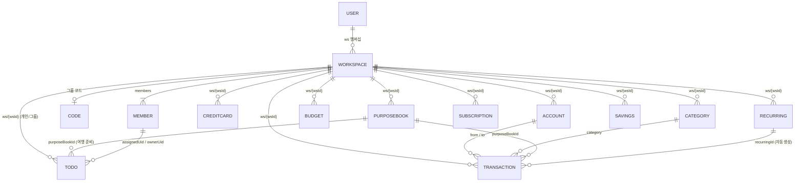

# 🗄️ 데이터 모델

저장소는 **Firebase Realtime Database**(프로젝트 `money-bb658`, asia-southeast1). 모든 가계부 데이터는 워크스페이스(`ws/{wsId}`) 아래에 격리됩니다. 보안규칙 원본은 `database.rules.json`, 상세 설명은 [RULES.md](deploy/rules.md).

## RTDB 트리 구조

```
users/{uid}            : { name, email, photo(프로필 사진 base64 data URL), createdAt, activeWs, recentWs:{ ledger, todo },  // 🔀 모드별 최근 컨텍스트 wsId(가계부/할일 각각 마지막 사용처 — 개인 프로필=ws_{uid} 또는 그룹). 모드 토글 시 각자 복원. activeWs=마지막 활성(하위호환)
                           welcomeGift(true=회원가입 축하선물 지급 완료·1회 멱등), profilePublic(기본 true·false면 랭킹·비친구에 은화+'알뜰' 익명), ws:{ {wsId}:true },
                           todos:{ {id}:{ title, note, dueDate, done, doneAt, repeat, purposeBookId?, rewardClaimed, sortOrder, createdAt, updatedAt } },  // ✅ 개인 할일(user-global — 워크스페이스 무관·항상 동일). 소유자=uid 암묵
                           onboarded: true,                        // 🧭 첫 사용자 온보딩 1회 표시 완료 플래그
                           push:{ token, at, ua },                 // 🔔 웹 푸시(FCM) 토큰 — 본인만 쓰기·발송기(admin)만 읽음. 알림 끄면 삭제. tools/send_reminders.mjs가 사용
                           pushMeta:{ lastGiftNotify },            // 🎁 친구선물 푸시 중복방지 워터마크(발송기 admin이 쓰기) — 이 시각 이후 선물만 알림. gift-notify 크론이 사용
                           todosMigrated: true,                    // 개인 할일 ws→user 1회 이전 완료 플래그
                           todoPublic: true|false,                 // 내 개인 할일을 친구에게 공개할지(친구 스트립·열람 대상)
                           friendCode: "ABC123",                   // 내 친구 코드(friendCodes 인덱스와 짝)
                           friends:{ {friendUid}:{ name, at } },   // 상호 친구(수락 시 양쪽 기록)
                           friendReqs:{ {fromUid}:{ name, at } },  // 받은 친구 요청(수락 시 삭제)
                           homeLikes:{ {visitorUid}:{ n, last:"YYYY-MM-DD" } },  // ❤️ 내 집(펫캠)에 받은 좋아요 — 방문자별 누적 n + 마지막 날짜(하루 1회). 총 좋아요=Σn. 쓰기=방문자 자신($visitor)만(규칙)
                           mailbox:{ {senderUid}:{ {giftId}:{ type:'consum'|'coins', key?, qty, from, fromName, at } } },  // 🎁 친구가 보낸 선물함(크로스유저). 쓰기=친구인 발신자만+엔트리 validate 상한(coins≤10·consum≤3·key∈{egg,water,food}, **금화 타입 차단**), 읽기=수령자 본인. 받기(claimMailGift)=자기 game에 반영 후 삭제. 펫알 선물(consum egg)은 은화100 지불·무료 응원선물은 rollFreeGift 랜덤(물/사료/은화, 금화 제외)
                           adminGifts:{ {pushId}:{ type:'coins'|'gold'|'consum', key?, qty, msg?, at } },  // 🎁 운영자가 이 사용자에게만 보낸 선물(비공개). 쓰기=**관리자 이메일 또는 본인**(규칙, 본인은 수령 후 삭제용), 읽기=본인(부모 규칙). 접속 시 claimAdminGifts가 game.gifts로 옮기고 삭제. msg=선물함 표시 사유(예: 오류 사과). 개발자 모드 '선물 보내기'에서 친구코드로 대상 지정(friendCodes→uid)
                           game:{ 🐱 고양이집(개인 전역, 워크스페이스 무관)
                             coins,                                  // 은화 잔액(정수, 최대 9,999,999 — normalizeGame에서 클램프)
                             gold,                                   // 금화(뽑기 오픈 +1 · 주간미션·업적·로그인 스트릭 마일스톤에서도 지급, 최대 999,999)
                             streak:{ last:"YYYY-MM-DD", count, best, lastReward? },  // 🔥 로그인(출석) 연속: 어제 출석 시 count+1, 아니면 1. 마일스톤(3·7·14·30, 이후 매30)에 은화+금화(loginStreakReward). autoClaimAttend에서 갱신
                             owned:{ cats:{ {catId}:{boughtAt, name?, affection?} }, items:{ {itemId}:{boughtAt,qty} }, wallpapers:{ {wallId}:{boughtAt} }, floors:{ {floorId}:{boughtAt} }, bgfx:{ {bgfxId}:{boughtAt} } },   // floors=바닥 스킨(FLOOR_CATALOG) · bgfx=배경효과(BGFX_CATALOG, 방 전체 앰비언트 오버레이·신화·own-once)  // affection=❤ 애정도(펫 탭 쓰다듬기 +1, 레벨 10/50/100 = affectionLevel)
                             consum:{ food, water, food_plus, water_plus, treat, tonic, egg, box, rainbow_egg, rainbow_box, ddeul },  // 🎒 가방(보유 소비 아이템 수, 각 최대 9,999): 사료·물·고급사료·정수물(그릇 채움) + 츄르(펫 애정+1) + 영양제(수확 부스트) + 펫알·랜덤박스(일반 오픈) + 무지개알·무지개박스(특별↑ 오픈) + 뜰알(한정 픽업)
                             home:{ rooms:[{ name, wallpaper:wallId, floor:floorId, bgfx:bgfxId?, placed:{ {"r_c"}:{itemId, filledAt?, fillMs?} }, wallPlaced:{ {"r_c"}:{itemId} }, active:[catId…], poops }…], current, showRoom, roomSlots, slots, changedAt:"ISO" },  // bgfx=그 방의 배경효과 오버레이 id(''=없음). 여러 방(프리셋): 방별 name·벽지·바닥가구배치(placed=바닥 가로12×깊이8, r_c의 r=깊이행 1~8·c=가로열 1~12 — 깊이 12→8 축소, 레거시 r>8은 normalizeHome이 맨앞행 8로 클램프)·**벽가구배치(wallPlaced=벽 12×4, r1=천장…r4=바닥선)**·활성펫·똥이 rooms[] 에 독립 저장 · current=선택 방 idx · showRoom=친구·랭킹에 보여줄 대표 방 idx · roomSlots=열린 방수(기본1·금화500로 최대5) · slots=방당 활성펫 상한(기본3·금화100로 확장, 전역) · changedAt=마지막 변경(친구 스토리 링) · filledAt=밥/물 채운 시각(ms) · fillMs=그 그릇 지속시간(고급사료·정수물=6h, 미지정=기본 3h FILL_MS; 지나면 비워지며 화장실 있으면 그 방 poops+1) · poops=그 방 미수거 똥(탭 시 +은화). **한 펫은 한 방에만**(normalizeHome이 방 간 중복 제거). 가구 인벤토리 소진(sumPlacedItem)은 placed+wallPlaced 합산(복제 방지). (레거시 flat home.active/placed/wallpaper/poops → 첫 로드시 rooms[0] 로 자동 이관, util.js normalizeHome) **⚠️ RTDB는 JS 배열을 보존하지 않는다**(키가 sparse하면 rooms를 객체 `{"1":{…}}`나 null 구멍 배열 `[null,{…}]`로 내려줌). normalizeHome은 `toRoomsArray(hr)`로 어떤 형태든 **존재하는 방을 잃지 않고** dense 배열로 복원한다 — `Array.isArray`만 믿으면 객체형 멀티룸을 flat으로 오인해 붕괴본으로 덮어써 **한쪽/모든 방 배치가 소실되던 버그**가 있었다(migrate 가드·reconcile 트랜잭션도 null 첫 패스에 기본 홈을 제안하지 않도록 abort). 근본 개선(방을 비정수 id 키맵으로 저장)은 후속 예정. **각 방엔 안정 id(`rooms[i].id`, `ensureRoomIds`가 없는 방에 1회 부여)** 가 있어, 방별 쓰기(이름·이모지·벽지·바닥·회수·비우기·삭제·복제)는 **인덱스가 아니라 id로 방을 찾아 트랜잭션(`roomTx`)** 으로 수정한다 → 다기기 재정렬/삭제 경합에도 엉뚱한 방을 건드리지 않는다(`current`/`showRoom`은 여전히 인덱스).
                             missions:{ {periodKey}:{ {missionId}:{claimed,reward,at} } },  // periodKey=KST 일자 2026-07-01(day)·주(week)·once. 일일/주간/업적 수령 기록(멱등)
                             customMissions:{ {id}:{ title, coinReward, active, createdAt, order } },  // 🎯 내 미션(커스텀 습관, 최대 5개) 정의. 보상은 7일 연속 마일스톤(coinReward는 레거시)
                             missionLogs:{ {missionId}:{ "YYYY-MM-DD":{ done, at, bonus } } },  // 내 미션 체크인 로그(날짜키=하루1회 멱등). bonus=그날 지급한 연속 마일스톤 보너스(재체크 재지급 방지). 매일 체크 무보상·7일 연속마다 은화
                             gifts:[ { type:'coins'|'consum', key?, qty, code, at } … ],  // 🎁 선물함(코드 보상 대기 목록) — 받기(claimGift) 시 은화는 coins로, 아이템은 consum(가방)으로
                             codes:{ {code}:{at, n} },                // 사용한 프로모/치트 코드(일반 1회·개발자 무한). n=사용 횟수
                             newsSeenAt:"YYYY-MM-DD",                 // 📢 마지막으로 '본' 공지 날짜(소식 화면 진입 시 markNewsSeen). 기기(localStorage)와 함께 더 최신을 사용해 기기 간 동기화
                             mail:{ free:{ "YYYY-MM-DD":count }, freeTo:{ "YYYY-MM-DD":{ {uid}:1 } }, egg:{ "YYYY-MM-DD":count } },  // 🎁 친구 선물 발신 하루 횟수(kstDayKey). 무료 응원=**친구당 하루 1번**(freeTo) + **전체 하루 5번**(free), 펫알=전체 하루 5번(egg). 클라이언트 게이트
                             bcSeen:{ {pushId}:true },  // 📣 이미 받은 전체 선물(config/broadcast) id 마커 — claimBroadcasts 멱등(재수령 방지). 선물함 gift에는 {msg, bc:true}로 사유 표시
                             freePull:{ ddeul|egg|box:"YYYY-MM-DD" },  // 🎁 가챠 배너 일일 무료 1뽑 사용 마커(kstDayKey) — 종류별 하루 1회, 밤 12시(KST 자정) 날짜키 전환으로 자연 초기화. 트랜잭션에서 재검증(멱등)해 다기기 이중 사용 방지
                             todoDay:{ day:"YYYY-MM-DD", n },   // ⏱️ 할일 완료 은화 하루 카운트(≤5, 경제 정책 §3-B). day 바뀌면 자연 리셋
                             petDay:{ day, n },                 // ⏱️ 쓰다듬기 은화 하루 카운트(≤3, 애정은 무제한, §3-C)
                             qualityDay:{ day, n },             // ⏱️ 성실 기록(카테고리+메모) 보너스 하루 카운트(≤3, §3-A)
                             gachaGold:{ day, n },              // 🥇 가챠 부산물 금화 하루 카운트(≤2뽑, 은화→금화 세탁 차단 §5). (harvestGold는 레거시·미사용)
                             buyDay:{ day, n:{ treat, tonic } },  // 🛒 하루 구매 카운트(품목별 dailyBuy: 츄르≤3·영양제 무료≤1). day 바뀌면 자연 리셋
                             boost:{ until, mult }              // 💊 수확 수익 부스트 버프: until(ms)>now면 mult(×1.5)를 유효 수익배율에 곱함. 영양제 사용 시 until 연장(activeBoostMult/effYieldMult)
                           } }
workspaces/{wsId}      : { name, photo(가계부 사진 base64 data URL, 선택), type:'personal'|'group', code(그룹), ownerUid, createdAt,
                           members:{ {uid}:{ name, role:'owner'|'member', joinedAt } } }
codes/{CODE}           : wsId            // 그룹 6자리 코드 → 워크스페이스 조회 인덱스
friendCodes/{CODE}      : uid            // 친구 6자리 코드 → 사용자 uid 조회 인덱스
migrationV3            : { by, at }      // v2→v3 데이터 1회 이전 잠금 플래그
presence/{uid}         : <서버시각(ms)>  // 🟢 접속 상태(setupPresence: .info/connected → set + onDisconnect().remove()). 정상 종료 시 자동 삭제(비정상 종료는 잔존 가능). 쓰기=본인($uid)만, 읽기=개발자 이메일만(규칙). 개발자 모드 '사용자 현황'(openDevUsers)에서 접속중 판별·인원 집계
rankings/{uid}         : { name, likes, private, at }  // 🏆 공개 랭킹 경량 인덱스(집 좋아요 TOP10). 소유자만 유지(watchMyLikes 좋아요 변동·프로필 저장·진입 시 writeMyRanking). likes=Σ homeLikes.n. 읽기=전체, 쓰기=본인($uid)만. 사진 미포함(상위권만 users/{uid}/photo 지연 로드)
homeCam/{uid}          : { name, emoji, wallpaper, floor, placed, wallPlaced, active, slots, poops, changedAt }  // 🏠🔒 친구·랭킹에 공개하는 **대표 방(showRoom)** 스냅샷만(벽가구 wallPlaced 포함). 소유자 game 변경 시 writeHomeCam이 갱신. 읽기=전체(친구 캠·스토리 변경시각), 쓰기=본인만. **users/{uid}/game(모든 방)은 소유자만 읽음** → 대표 방 외 다른 방은 실제로 비공개.
catalogPets/{id}       : { name, species, speciesLabel?, tier, scale, gachaOnly?, exActive?, frontWalk, frames?, clips?, hasArt?, deleted?, by, at }  // 🐯 런타임 펫/정적 오버라이드 **메타데이터**(앱에서 dev가 zip 업로드·수정·삭제 → 전역). 읽기=전체, 쓰기=개발자 이메일만(규칙). 앱 로드 시 PET_CATALOG/PET_SPRITES/CAT_TIER/SPECIES_LABEL/_petGachaOnly/_petExActive에 병합. 신규 런타임 펫 또는 정적 펫 오버라이드(이름·등급·디자인·`deleted:true` 소프트삭제) 겸용. `gachaOnly:true`=알뜰샵 판매목록 숨김·`false`=등급 무관 판매(미설정=등급 기반 기본값, `isGachaOnlyCat`). `exActive`=한정(exclusive) 펫의 가챠 등장 여부(true=펫알 한정 리스트·확률 포함, 미설정=`EX_ACTIVE_DEFAULT`=삵·표범만). `hasArt:true`=이미지가 catalogPetArt에 있음(지연 로드). `frames`=걷기 프레임 수(6·8 등), `clips`=🎞️ 다중 모션 클립 메타(클립키→프레임 수, 시트는 catalogPetArt.clips — zip 재업로드 시 통째 교체·없으면 null 소거). ※구 레코드는 `walk/south/…` 인라인 data URL을 가질 수 있음(하위호환) — `migrateCatalogArtOnce()`로 분리 이전
catalogPetArt/{id}     : { walk, south, north, east, west(=data URL PNG), clips?:{ idle|sit|belly|eat|drink|run|jump|yawn|angry|sleep:<data URL 시트> } }  // 🖼️ 런타임 펫 스프라이트(base64) — 메타와 분리 저장. 앱 시작 땐 안 받고, 실제로 보이는 펫만 `ensurePetArt()`가 `.once`로 1회 받아 세션 캐시(초기 로딩/재푸시 부담↓). 🎞️ clips=다중 모션 클립 시트(가로 스트립, 프레임 수는 catalogPets/{id}.clips 메타). 읽기=전체, 쓰기=개발자 이메일만
config/notices         : [ { date:"YYYY-MM-DD", t, s } … ]  // 📢 소식 화면 '공지사항 > 업데이트 내역'. 읽기=로그인 전체, 쓰기=개발자 이메일만(규칙). 앱이 loadNotices로 구독해 배포 없이 갱신(비어있으면 cats.js 기본 NOTICES 폴백). 최신 1건만 노출. 🔒 일반 사용자에게 노출됨 — 개발자 모드·치트·내부 도구 등 비공개 내용은 절대 넣지 말 것(방어로 isDevNotice가 필터). CLAUDE.md '운영 유출 금지' 참고
config/announce/{pushId} : { title, body, at }              // 📢 소식 화면 '공지사항 > 운영자 공지'(제목+내용). 읽기=로그인 전체, 쓰기=개발자 이메일만(규칙). loadAnnounce 구독 → catNewsHtml에 업데이트 내역과 함께 표시(전체 노출·최신순). 개발자 모드 '공지사항 관리'(sendAnnounce/deleteAnnounce)에서 등록/삭제. ⚠️ 사용자 대면이라 내부 내용 금지
config/featuredPet     : { "M2026-07": "cat_id", … }         // 🌟 이달의 펫 수동 선정(월키→펫 id). 읽기=로그인 전체, 쓰기=개발자 이메일만(규칙). loadFeaturedPet 구독, featuredCatId가 해당 월 값 있으면 우선 사용(없으면 featuredPetOfMonth 해시 폴백). 개발자 모드 '이달의 펫 선정'(openDevFeatured)에서 편집
config/gachaFx         : { a:"pet_id", b:"pet_id" }           // 🎬 가챠 오픈 연출 펫(a=연출1번/왼쪽 등장, b=연출2번/오른쪽 등장). 읽기=로그인 전체, 쓰기=개발자 이메일만(규칙). loadGachaFx 구독, fxClimax가 지정 펫을 걸어와 톡 치게 연출(미지정이면 기본 검은 고양이). 개발자 모드 '펫 관리'(setGachaFxSlot)에서 편집
config/broadcast/{pushId} : { type:'coins'|'gold'|'consum', key?, qty, msg?, at }  // 📣 전체 선물(운영자 → 모든 사용자 선물함). 읽기=로그인 전체, 쓰기=개발자 이메일만(규칙). loadBroadcasts 구독 → claimBroadcasts가 각 사용자 game.gifts에 1회 추가(game.bcSeen[pushId] 마커로 멱등). msg=선물함에 표시할 사유(예: 오류 사과). 개발자 모드 '전체 선물 보내기'(sendBroadcast)에서 push. 오래된 항목은 콘솔에서 삭제(신규 전파만 멈춤, 이미 받은 사람 유지)
config/furniture/{itemId} : { tier?, price?, gacha? }         // 🪑 기구물(가구) 전역 등급/가격/가챠전용 오버라이드. 읽기=로그인 전체, 쓰기=개발자 이메일만(규칙). loadFurnCfg 구독 → effItemTier(등급)·itemBuyPrice(은화가)가 기본값(ITEM_TIER/ITEM_CATALOG.price)에 병합. 미설정=기본값, 항목 remove=기본값 복귀. `gacha:true/false`=가챠전용 명시 오버라이드(미설정=특별↑ 자동, isGachaOnlyItem) — true면 알뜰샵 판매목록 숨김. 개발자 모드 '기구물 관리' 가구 탭(setFurnTier/setFurnPrice/setFurnGacha/resetFurn)에서 편집
config/wallpaper/{id}     : { tier?, price?, gacha? }         // 🧱 벽지 전역 등급/가격/가챠전용 오버라이드. loadWallCfg 구독 → wallTierOf(effWallTier)·wallBuyPrice(price 미설정 시 등급가 TIER_PRICE[tier], default=0)에 병합. 등급 바꾸면 가격이 등급가로 자동 반영(setWallTier가 price 오버라이드 제거). `gacha`=가챠전용 명시(미설정=특별↑ 자동, isGachaOnlyWall). '기구물 관리' 벽지 탭에서 편집(규칙=config 상위가 커버, 변경 불필요)
config/floor/{id}         : { tier?, price?, gacha? }         // 🟫 바닥 스킨 전역 등급/가격/가챠전용 오버라이드. loadFloorCfg 구독 → floorTierOf(effFloorTier)·floorBuyPrice(price 미설정 시 등급가 TIER_PRICE[tier], default=0)에 병합. 등급 바꾸면 가격 자동 반영(setFloorTier가 price 오버라이드 제거). `gacha`=가챠전용 명시(미설정=특별↑ 자동, isGachaOnlyFloor). '기구물 관리' 바닥 탭에서 편집
ws/{wsId}/             : 가계부 데이터 (아래 노드들)
  ├─ accounts/{id}
  ├─ creditCards/{id}
  ├─ categories/{name}
  ├─ budgets/{id}
  ├─ subscriptions/{id}
  ├─ purposeBooks/{id}
  ├─ people/{id}
  ├─ giftEvents/{id}
  ├─ plannedGiftEvents/{id}
  ├─ loans/{id}                  // 대출/이자
  ├─ loanPayments/{id}           // 대출 상환 기록
  ├─ todos/{id}                  // 할일(개인/그룹 — scope 필드로 구분)
  ├─ todoShare/{uid}             // 개인 할일 공유 on/off(멤버별)
  ├─ settings                    // 워크스페이스 공동 설정(기본 공개범위/소유자)
  ├─ catDeleted/{name}           // 삭제한 기본 카테고리 툼스톤(재시딩 방지)
  ├─ transactions/{uid}/{id}     // 사용자별로 분리 저장
  ├─ savings/{uid}/{id}
  ├─ recurring/{uid}/{id}
  ├─ recurringLogs/{uid}/{key}   // 반복거래 멱등 로그
  └─ settlementPayments/{uid}/{id}   // 정산 송금 완료/취소 기록(Step 9)
```

> `transactions`/`savings`/`recurring`/`recurringLogs` 는 `{uid}` 하위로 한 단계 더 나뉘어 누가 기록했는지 보존합니다. 앱은 리스너에서 `ownerUid` 를 붙여 평탄화합니다(`setupListeners` in `core.js`).

## ERD (엔티티 관계)



## 핵심 엔티티 필드

### transactions/{uid}/{id}
`type`, `date`(ISO), `amount`, `desc`, `category`, `from`(차감 계좌), `to`(가산 계좌), `user`(**소비 대상** — 지출/선불결제/포인트사용 시 입력 시트에서 선택한 멤버명 또는 `공동`. 출금 수단(`from`)과 분리. 그 외 유형·기본값은 본인명), `memo`, `isActualExpense`(통계 포함 여부), `recurringId`, `cardPerformanceIncluded`·`cardPerformanceAmount`·`cardPerformanceExcludedReason`, `purposeBookId`·`purposeBookName`. **정산(Step 9, 활성)**: `settlementIncluded`(bool), `payer`, `splitType`(none/equal/custom/payer_only), `splitParticipants`[], `splitAmounts`{이름:금액}, `settlementStatus`(none/unsettled/partially_settled/settled), `settlementMemo`. **경조사비**: `giftEventId`. **대출**: `loanId`(연결된 대출의 이자 거래). **해외통화(여행)**: `currency`(예: USD)·`foreignAmount`(외화 원금)·`fxRate`(원화 per 1단위)·`fxSource`(live/manual)·`fxDate` — 없으면 원화. `amount`는 항상 **원화 환산액**이라 통계·잔액·예산은 그대로. **`userUid`**(소비 대상이 멤버일 때 그 멤버 uid를 병행 저장 — 리포트 개인별 집계를 uid로 해 **동명이인·개명에 견고**. `user`는 표시용 이름으로 계속 저장, 공동/레거시 거래는 uid 없음). (리스너가 `ownerUid`·`id` 부착)

### 경조사비 (people / giftEvents / plannedGiftEvents)  — 모두 flat `ws/{wsId}/...`
- **people/{id}**: `name`, `relation`(REL_TYPES), `memo`, `createdAt`·`updatedAt`. 경조사비 기록 시 상대 이름으로 자동 등록.
- **giftEvents/{id}**: `personId`·`personName`, `relation`, `eventType`(GIFT_EVENT_TYPES), `direction`(given/received), `amount`, `date`, `memo`, `linkedTransactionId`·`linkedAccount`(거래 연결 시), `owner`, `visibility`, `createdAt`·`updatedAt`.
- **plannedGiftEvents/{id}**: `personName`, `eventType`, `expectedAmount`, `date`, `status`(planned/completed/cancelled), `memo`, `createdAt`·`updatedAt`.

### settings  — `ws/{wsId}/settings` (워크스페이스 공동 설정)
`defaultVisibility`(full/private — 새 항목 기본 공개범위), `defaultOwner`(common/me — 새 항목 기본 소유자), `updatedAt`. 멤버 누구나 쓰기(ws 멤버 규칙). 앱은 `defaultVisibility()`·`defaultOwnerName()`로 생성 폼 기본값에 반영.

### 멤버/권한 (workspaces/{wsId}/members)
`members/{uid}:{name, role(owner/member), joinedAt}` + `ownerUid`. 소유자 전용 동작(이름 변경·소유자 이전·멤버 내보내기)은 **앱 UI에서만 제한**(RTDB 규칙은 그룹 멤버 공동 쓰기 유지). 소유자 이전 = `ownerUid` + 두 멤버 `role` 갱신.

### 대출 (loans / loanPayments)  — 모두 flat `ws/{wsId}/...`
- **loans/{id}**: `name`, `direction`(borrowed/lent), `counterparty`, `principal`(원금), `interestRate`(연%), `startDate`·`dueDate`, `account`(기본 상환계좌), `status`(active/paid/overdue), `memo`, `owner`, `visibility`, `createdAt`·`updatedAt`. 잔액·이자는 `loanCalc`로 계산(저장 안 함).
- **loanPayments/{id}**: `loanId`, `date`, `principalAmount`(원금 상환), `interestAmount`(이자), `account`, `memo`, `linkedTransactionId`(이자 거래), `linkedPrincipalTxId`(원금 거래 — 실지출 통계 제외 `isActualExpense:false`), `createdAt`·`updatedAt`. 상환 시 원금·이자가 각각 거래로 연결돼 계좌 잔액에 반영됨(원금은 부채 상환이라 실소비 통계엔 미포함).

### settlementPayments/{uid}/{id}  (정산 송금 기록, Step 9)
`owner`, `purposeBookId`, `fromPerson`, `toPerson`, `amount`, `paymentDate`, `status`(paid/cancelled), `memo`, `linkedTransactionId`(선택: 실제 이체 거래 생성 시), `createdAt`·`updatedAt`. 정산 송금 **제안은 저장하지 않고** `pbSettleSummary()`가 매번 계산하며, 사용자가 "완료"한 송금만 여기에 기록됩니다.

### accounts/{id}
`name`, `type`(현금/은행/신용카드/체크카드/선불/포인트/간편결제/상품권/기타), `provider`(직접/네이버페이/쿠팡/카카오페이/토스/기타), `owner`(멤버명 또는 '공동'), `initialBalance`, `visibility`(full/balance_only/private), `color`, `order`, `memo`.

### creditCards/{id}
`cardName`, `cardCompany`, `monthlyPerformanceTarget`, `performancePeriodType`(calendar_month/custom), `performanceStartDay`, `includePrepaidCharge`, `excludedCategories[]`, `defaultIncluded`, `visibility`, `memo`.

### 할일 — 개인(user-global) vs 그룹(ws)
- **개인 할일 `users/{uid}/todos/{id}`**(user-global): `title, note, dueDate, done, doneAt, repeat, purposeBookId?, rewardClaimed, sortOrder, createdAt, updatedAt`. **워크스페이스와 무관**하게 내 프로필에 귀속(그룹을 바꿔도 동일). 쓰기는 본인만(`users/$uid` 규칙), **읽기는 로그인 유저 전역**(`users .read`)이라 친구가 열람 가능(앱은 `todoPublic`인 친구만 노출). 기존 `ws`의 `scope=personal` 할일은 `migratePersonalTodos()`로 1회 이전.
- **그룹 할일 `ws/{wsId}/todos/{id}`**: `scope`(group — 누락 시 group), `title, note, assignedUid`(담당 멤버)·`assignedName, dueDate, done/doneAt/doneByUid, repeat, purposeBookId, rewardClaimed, createdByUid, sortOrder, createdAt, updatedAt`. 워크스페이스 멤버 공동 편집.

### 친구 (users/{uid}/friends · friendReqs · friendCode · todoPublic · friendCodes)
- **friendCode**(6자) + 인덱스 **`friendCodes/{CODE}=uid`**: 코드로 상대를 찾음(`ensureFriendCode` 백필).
- **친구 요청**: 요청자가 `users/{targetUid}/friendReqs/{fromUid}={name,at}` 기록 → 대상이 수락 시 **양쪽** `users/{uid}/friends/{otherUid}={name,at}` 기록 + 요청 삭제(`acceptFriend`). 규칙상 `friends`/`friendReqs`의 `$fid`는 **당사자 두 명만** 쓰기.
- **todoPublic**(bool): 내 개인 할일 공개 여부. 개인 탭 상단 친구 스트립엔 `todoPublic`인 친구만 뜨고, 탭하면 그 친구 `users/{uid}/todos`를 **읽기전용**으로 열람(`viewFriendTodos`, 임시 리스너). 공개는 **UI 레벨 필터**(읽기 규칙은 전역).
- (레거시) `ws/{wsId}/todoShare/{uid}` 는 그룹 단위 공유 플래그였으나 친구 시스템으로 대체됨.

### categories/{name}
`name`, `type`(expense/income/transfer/other 등), `icon`(이모지), `color`, `sortOrder`, `isDefault`, `isActive`, `visibility`(full/private), `owner`. 기본 카테고리는 `buildDefaultCategories` 시딩(신규 기본은 `migrateCategories`가 기존 사용자에도 자동 추가). **기본 카테고리도 수정·삭제 가능**하며, 삭제한 기본은 `ws/{wsId}/catDeleted/{name}=true` 툼스톤으로 표시해 재시딩되지 않음(같은 이름 재생성 시 툼스톤 해제).

### budgets/{id}
`categoryName`(null=총예산), `amount`, `periodType`(monthly/weekly/yearly/custom), `scope`(group/personal), `owner`, `alertEnabled`, `alertThreshold`, `visibility`, `purposeBookId`, `createdAt`, `updatedAt`.

### recurring/{uid}/{id}
`type`, `amount`, `desc`, `from`, `to`, `category`, `freq`(daily/weekly/monthly/yearly/custom), `interval`, `day`, `weekday`, `startDate`, `endDate`, `lastPosted`, `nextRunDate`, `status`(active/paused/ended), `autoCreate`, `user`, `visibility`, 카드실적 필드.

### subscriptions/{id}
`name`, `type`(SUB_TYPES), `status`(active/paused/cancelled/expired), `amount`, `billingCycle`, `billingInterval`, `nextBillingDate`, `expirationDate`, `autoRenew`, `isTrial`, `trialEndDate`, `visibility`, `owner`.

### purposeBooks/{id}
`name`, `type`(PB_TYPES), `customTypeName`, `icon`, `status`(active/completed/archived), `budgetAmount`, `startDate`, `endDate`, `settlementEnabled`, `visibility`, `owner`.

### savings/{uid}/{id}
`name`, `goal`, `current`, `user`.

## 거래 타입 → 잔액효과

`public/js/constants.js` 의 `TX_EFFECT` 정의. `debit`=from 계좌에서 차감, `credit`=to 계좌에 가산.

| 타입 | 효과 | 설명 |
|---|---|---|
| income | credit→to | 수입 가산 |
| expense | debit→from | 지출 차감 |
| transfer | debit→from, credit→to | 계좌 간 이동 |
| prepaid_charge | debit→from, credit→to | 선불충전(현금→선불금) |
| prepaid_spend | debit→from | 선불금 사용 |
| refund | credit→to | 환불 입금 |
| point_earn | credit→to | 포인트 적립 |
| point_spend | debit→from | 포인트 사용 |
| balance_adjustment | credit→to | 잔액 보정(음수 amount 허용) |

## 보안규칙 요약

| 경로 | read | write |
|---|---|---|
| `users/{uid}` | 로그인(전역) | 본인 uid 만 |
| `users/{uid}/friends/{fid}`·`friendReqs/{fid}` | 로그인 | **당사자 두 명만**($uid 또는 $fid) — 친구 요청/수락 |
| `codes/*`·`friendCodes/*` | 로그인 | 로그인(코드 등록/조회) |
| `workspaces/{wsId}` | 로그인 | 멤버 또는 **본인을 멤버로 추가(셀프 합류)** 시 |
| `ws/{wsId}/**` | 그 워크스페이스 **멤버만** | 그 워크스페이스 **멤버만** |
| 레거시 루트(`accounts` 등) | 로그인 | 로그인 — 이전용 백업 |

**신뢰 모델**: 격리 단위는 워크스페이스. 비멤버는 `ws/{wsId}` 를 읽거나 쓸 수 없습니다. 그룹 내부는 공동 권한(멤버끼리 서로의 거래까지 read/write). `private` 등 세부 공개 제한은 **앱 UI**가 담당합니다(DB 규칙은 자식별 read 필터 불가). 전체 설명·테스트 케이스는 [RULES.md](deploy/rules.md).

## v2 → v3 마이그레이션

구버전은 전역 단일 트리(`accounts` 등 루트)에 데이터를 두었습니다. v3는 워크스페이스 모델로 바뀌어, 로그인 시 `migrateLegacyIfNeeded()` 가 **"공유 가계부" 그룹**을 만들고 기존 모든 사용자를 멤버로 넣은 뒤 데이터를 `ws/{wsId}` 아래로 복사합니다. `migrationV3` 플래그로 1회만 실행되며, 원본 루트 데이터는 백업으로 남습니다.
