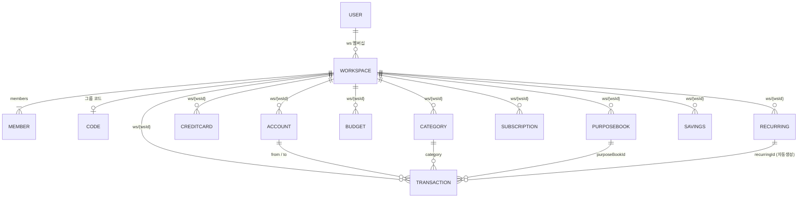

# 🗄️ 데이터 모델

저장소는 **Firebase Realtime Database**(프로젝트 `money-bb658`, asia-southeast1). 모든 가계부 데이터는 워크스페이스(`ws/{wsId}`) 아래에 격리됩니다. 보안규칙 원본은 `database.rules.json`, 상세 설명은 [RULES.md](deploy/rules.md).

## RTDB 트리 구조

```
users/{uid}            : { name, email, photo(프로필 사진 base64 data URL), createdAt, activeWs, ws:{ {wsId}:true } }
workspaces/{wsId}      : { name, type:'personal'|'group', code(그룹), ownerUid, createdAt,
                           members:{ {uid}:{ name, role:'owner'|'member', joinedAt } } }
codes/{CODE}           : wsId            // 그룹 6자리 코드 → 워크스페이스 조회 인덱스
migrationV3            : { by, at }      // v2→v3 데이터 1회 이전 잠금 플래그
ws/{wsId}/             : 가계부 데이터 (아래 노드들)
  ├─ accounts/{id}
  ├─ creditCards/{id}
  ├─ categories/{name}
  ├─ budgets/{id}
  ├─ subscriptions/{id}
  ├─ purposeBooks/{id}
  ├─ people/{id}
  ├─ giftEvents/{id}
  ├─ plannedGiftEvents/{id}
  ├─ transactions/{uid}/{id}     // 사용자별로 분리 저장
  ├─ savings/{uid}/{id}
  ├─ recurring/{uid}/{id}
  ├─ recurringLogs/{uid}/{key}   // 반복거래 멱등 로그
  └─ settlementPayments/{uid}/{id}   // 정산 송금 완료/취소 기록(Step 9)
```

> `transactions`/`savings`/`recurring`/`recurringLogs` 는 `{uid}` 하위로 한 단계 더 나뉘어 누가 기록했는지 보존합니다. 앱은 리스너에서 `ownerUid` 를 붙여 평탄화합니다(`setupListeners` in `core.js`).

## ERD (엔티티 관계)



## 핵심 엔티티 필드

### transactions/{uid}/{id}
`type`, `date`(ISO), `amount`, `desc`, `category`, `from`(차감 계좌), `to`(가산 계좌), `user`(**소비 대상** — 지출/선불결제/포인트사용 시 입력 시트에서 선택한 멤버명 또는 `공동`. 출금 수단(`from`)과 분리. 그 외 유형·기본값은 본인명), `memo`, `isActualExpense`(통계 포함 여부), `recurringId`, `cardPerformanceIncluded`·`cardPerformanceAmount`·`cardPerformanceExcludedReason`, `purposeBookId`·`purposeBookName`. **정산(Step 9, 활성)**: `settlementIncluded`(bool), `payer`, `splitType`(none/equal/custom/payer_only), `splitParticipants`[], `splitAmounts`{이름:금액}, `settlementStatus`(none/unsettled/partially_settled/settled), `settlementMemo`. **경조사비**: `giftEventId`. **대출**: `loanId`(연결된 대출의 이자 거래). (리스너가 `ownerUid`·`id` 부착)

### 경조사비 (people / giftEvents / plannedGiftEvents)  — 모두 flat `ws/{wsId}/...`
- **people/{id}**: `name`, `relation`(REL_TYPES), `memo`, `createdAt`·`updatedAt`. 경조사비 기록 시 상대 이름으로 자동 등록.
- **giftEvents/{id}**: `personId`·`personName`, `relation`, `eventType`(GIFT_EVENT_TYPES), `direction`(given/received), `amount`, `date`, `memo`, `linkedTransactionId`·`linkedAccount`(거래 연결 시), `owner`, `visibility`, `createdAt`·`updatedAt`.
- **plannedGiftEvents/{id}**: `personName`, `eventType`, `expectedAmount`, `date`, `status`(planned/completed/cancelled), `memo`, `createdAt`·`updatedAt`.

### settings  — `ws/{wsId}/settings` (워크스페이스 공동 설정)
`defaultVisibility`(full/private — 새 항목 기본 공개범위), `defaultOwner`(common/me — 새 항목 기본 소유자), `updatedAt`. 멤버 누구나 쓰기(ws 멤버 규칙). 앱은 `defaultVisibility()`·`defaultOwnerName()`로 생성 폼 기본값에 반영.

### 멤버/권한 (workspaces/{wsId}/members)
`members/{uid}:{name, role(owner/member), joinedAt}` + `ownerUid`. 소유자 전용 동작(이름 변경·소유자 이전·멤버 내보내기)은 **앱 UI에서만 제한**(RTDB 규칙은 그룹 멤버 공동 쓰기 유지). 소유자 이전 = `ownerUid` + 두 멤버 `role` 갱신.

### 대출 (loans / loanPayments)  — 모두 flat `ws/{wsId}/...`
- **loans/{id}**: `name`, `direction`(borrowed/lent), `counterparty`, `principal`(원금), `interestRate`(연%), `startDate`·`dueDate`, `account`(기본 상환계좌), `status`(active/paid/overdue), `memo`, `owner`, `visibility`, `createdAt`·`updatedAt`. 잔액·이자는 `loanCalc`로 계산(저장 안 함).
- **loanPayments/{id}**: `loanId`, `date`, `principalAmount`(원금 상환), `interestAmount`(이자), `account`, `memo`, `linkedTransactionId`(이자 거래), `createdAt`·`updatedAt`.

### settlementPayments/{uid}/{id}  (정산 송금 기록, Step 9)
`owner`, `purposeBookId`, `fromPerson`, `toPerson`, `amount`, `paymentDate`, `status`(paid/cancelled), `memo`, `linkedTransactionId`(선택: 실제 이체 거래 생성 시), `createdAt`·`updatedAt`. 정산 송금 **제안은 저장하지 않고** `pbSettleSummary()`가 매번 계산하며, 사용자가 "완료"한 송금만 여기에 기록됩니다.

### accounts/{id}
`name`, `type`(현금/은행/신용카드/체크카드/선불/포인트/간편결제/상품권/기타), `provider`(직접/네이버페이/쿠팡/카카오페이/토스/기타), `owner`(멤버명 또는 '공동'), `initialBalance`, `visibility`(full/balance_only/private), `color`, `order`, `memo`.

### creditCards/{id}
`cardName`, `cardCompany`, `monthlyPerformanceTarget`, `performancePeriodType`(calendar_month/custom), `performanceStartDay`, `includePrepaidCharge`, `excludedCategories[]`, `defaultIncluded`, `visibility`, `memo`.

### categories/{name}
`name`, `type`(expense/income/other), `icon`(이모지), `color`, `sortOrder`, `isDefault`, `isActive`, `visibility`(full/private), `owner`. 기본 22종은 `buildDefaultCategories` 시딩.

### budgets/{id}
`categoryName`(null=총예산), `amount`, `periodType`(monthly/weekly/yearly/custom), `scope`(group/personal), `owner`, `alertEnabled`, `alertThreshold`, `visibility`, `purposeBookId`, `createdAt`, `updatedAt`.

### recurring/{uid}/{id}
`type`, `amount`, `desc`, `from`, `to`, `category`, `freq`(daily/weekly/monthly/yearly/custom), `interval`, `day`, `weekday`, `startDate`, `endDate`, `lastPosted`, `nextRunDate`, `status`(active/paused/ended), `autoCreate`, `user`, `visibility`, 카드실적 필드.

### subscriptions/{id}
`name`, `type`(SUB_TYPES), `status`(active/paused/cancelled/expired), `amount`, `billingCycle`, `billingInterval`, `nextBillingDate`, `expirationDate`, `autoRenew`, `isTrial`, `trialEndDate`, `visibility`, `owner`.

### purposeBooks/{id}
`name`, `type`(PB_TYPES), `customTypeName`, `icon`, `status`(active/completed/archived), `budgetAmount`, `startDate`, `endDate`, `settlementEnabled`, `visibility`, `owner`.

### savings/{uid}/{id}
`name`, `goal`, `current`, `user`.

## 거래 타입 → 잔액효과

`public/js/constants.js` 의 `TX_EFFECT` 정의. `debit`=from 계좌에서 차감, `credit`=to 계좌에 가산.

| 타입 | 효과 | 설명 |
|---|---|---|
| income | credit→to | 수입 가산 |
| expense | debit→from | 지출 차감 |
| transfer | debit→from, credit→to | 계좌 간 이동 |
| prepaid_charge | debit→from, credit→to | 선불충전(현금→선불금) |
| prepaid_spend | debit→from | 선불금 사용 |
| refund | credit→to | 환불 입금 |
| point_earn | credit→to | 포인트 적립 |
| point_spend | debit→from | 포인트 사용 |
| balance_adjustment | credit→to | 잔액 보정(음수 amount 허용) |

## 보안규칙 요약

| 경로 | read | write |
|---|---|---|
| `users/{uid}` | 로그인 | 본인 uid 만 |
| `codes/*` | 로그인 | 로그인(코드 등록/조회) |
| `workspaces/{wsId}` | 로그인 | 멤버 또는 **본인을 멤버로 추가(셀프 합류)** 시 |
| `ws/{wsId}/**` | 그 워크스페이스 **멤버만** | 그 워크스페이스 **멤버만** |
| 레거시 루트(`accounts` 등) | 로그인 | 로그인 — 이전용 백업 |

**신뢰 모델**: 격리 단위는 워크스페이스. 비멤버는 `ws/{wsId}` 를 읽거나 쓸 수 없습니다. 그룹 내부는 공동 권한(멤버끼리 서로의 거래까지 read/write). `private` 등 세부 공개 제한은 **앱 UI**가 담당합니다(DB 규칙은 자식별 read 필터 불가). 전체 설명·테스트 케이스는 [RULES.md](deploy/rules.md).

## v2 → v3 마이그레이션

구버전은 전역 단일 트리(`accounts` 등 루트)에 데이터를 두었습니다. v3는 워크스페이스 모델로 바뀌어, 로그인 시 `migrateLegacyIfNeeded()` 가 **"공유 가계부" 그룹**을 만들고 기존 모든 사용자를 멤버로 넣은 뒤 데이터를 `ws/{wsId}` 아래로 복사합니다. `migrationV3` 플래그로 1회만 실행되며, 원본 루트 데이터는 백업으로 남습니다.
